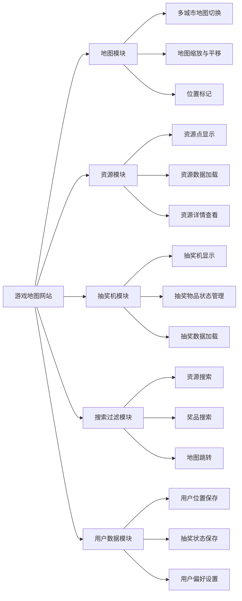
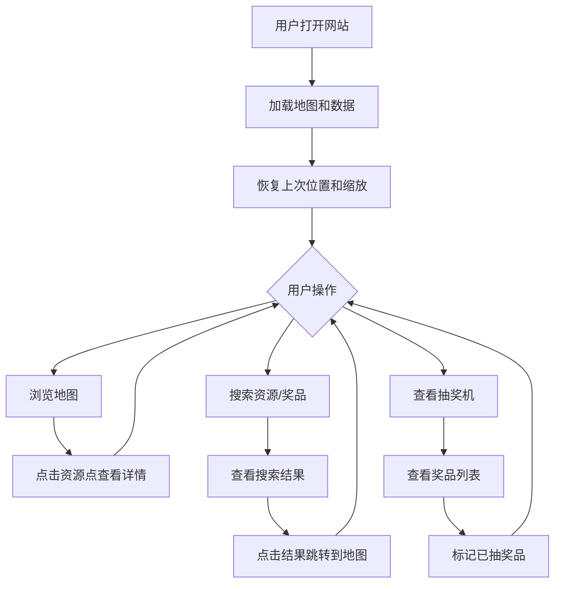
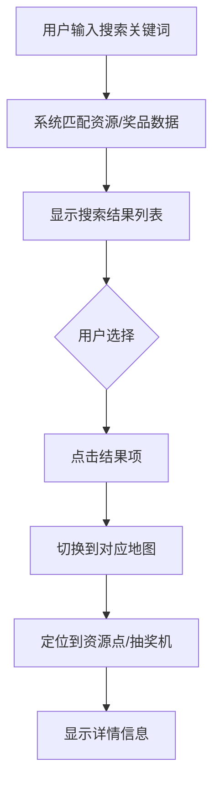
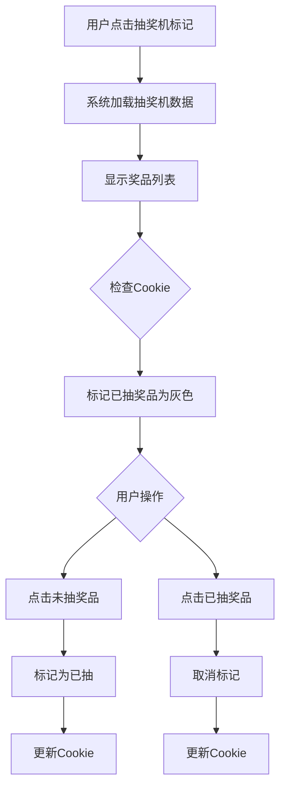

# 产品需求文档(PRD)

## 1. 文档信息

### 1.1 版本历史
| 版本 | 日期       | 作者   | 变更描述               |
|------|------------|--------|------------------------|
| v1.0 | 2025-8-11 | 产品经理 | 初始版本创建           |

### 1.2 文档目的
本文档详细描述游戏地图网站的产品需求，作为设计、开发和测试团队的工作依据。

### 1.3 相关文档引用
- 无

## 2. 产品概述

### 2.1 产品名称与定位
- **产品名称**：杖剑传说地图
- **产品定位**：为游戏玩家提供便捷的资源采集点查询、抽奖机管理的工具型网站

### 2.2 产品愿景与使命
- **愿景**：成为游戏玩家必备的资源查询与导航平台
- **使命**：帮助玩家更高效地探索游戏世界，提升游戏体验

### 2.3 价值主张与独特卖点(USP)
- **价值主张**：提供精准的游戏资源位置信息，便捷的抽奖机管理，以及智能的资源搜索与导航
- **独特卖点**：
  1. 一体化资源与抽奖机管理
  2. 本地数据存储，无需登录即可保存用户状态

### 2.4 目标平台列表
- Web (Chrome, Firefox, Safari, Edge等主流浏览器,需要支持移动端)

### 2.5 产品核心假设
1. 玩家需要一个集中式平台查询游戏资源位置
2. 玩家希望能够记录和管理已获取的抽奖物品
3. 玩家需要快速找到特定资源并导航至相应位置

### 2.6 商业模式概述
- 初期：免费使用，通过广告变现
- 未来：可考虑推出高级功能订阅制

## 3. 用户研究

### 3.1 目标用户画像
#### 3.1.1 人口统计特征
- 年龄：12-35岁
- 性别：都有
- 职业：学生和职场人士各占约50%
- 游戏经验：以中度到重度玩家为主

#### 3.1.2 行为习惯与偏好
- 每周游戏时间：20-50小时
- 偏好探索类和资源收集类游戏
- 习惯使用工具类网站辅助游戏

#### 3.1.3 核心需求与痛点
- **核心需求**：快速找到游戏资源位置，管理抽奖物品
- **痛点**：
  1. 游戏内资源分布信息分散，查找困难
  2. 无法记录已获取的抽奖物品，重复尝试浪费时间
  3. 无法快速定位到特定资源所在地图

#### 3.1.4 动机与目标
- 动机：提升游戏效率，减少重复探索时间
- 目标：快速收集游戏资源，提升游戏体验

### 3.2 用户场景分析
#### 3.2.1 核心使用场景详述
**场景1：资源采集**
- 用户故事：作为一名游戏玩家，我想要快速找到特定资源的位置，以便高效采集资源。
- 场景描述：用户打开网站，搜索特定资源，查看资源分布地图，然后导航到目标位置。

**场景2：抽奖机管理**
- 用户故事：作为一名游戏玩家，我想要记录已从抽奖机中获得的物品，以便避免重复尝试。
- 场景描述：用户打开网站，选择特定地图的抽奖机，标记已获得的物品，系统保存状态。

#### 3.2.2 边缘使用场景考量
- 新玩家熟悉游戏世界
- 玩家分享资源位置给好友
- 玩家规划资源采集路线

### 3.3 用户调研洞察
- 80%的玩家表示在游戏中花费大量时间寻找资源
- 75%的玩家希望有工具记录抽奖物品获取状态
- 90%的玩家愿意使用免费工具提升游戏效率

## 4. 市场与竞品分析

### 4.1 市场规模与增长预测
- 全球游戏工具类市场规模约10亿美元
- 年增长率约15%
- 玩家对辅助工具的需求持续增长

### 4.2 行业趋势分析
- 游戏工具向多功能一体化方向发展
- 越来越多的工具采用本地存储技术，保护用户隐私
- 移动端游戏工具增长迅速，但Web端仍占据重要地位

### 4.3 竞争格局分析
#### 4.3.1 直接竞争对手详析
| 竞品名称 | 优势 | 劣势 | 定价 | 特性 |
|----------|------|------|------|------|
| 游戏地图A | 资源数据全面 | 界面复杂，广告过多 | 免费 | 资源查询 |
| 游戏助手B | 界面简洁 | 资源数据更新不及时 | 免费+高级订阅 | 资源查询 |

#### 4.3.2 间接竞争对手概述
- 游戏内置地图功能：集成度高，但功能有限
- 游戏论坛：信息分散，查找困难
- 视频教程：直观，但无法互动查询

### 4.4 竞品功能对比矩阵
| 功能 | 我们的产品 | 游戏地图A | 游戏助手B |
|------|------------|----------|----------|
| 多城市地图 | ✅ | ✅ | ❌ |
| 资源点坐标数据文件加载 | ✅ | ❌ | ❌ |
| 抽奖机管理 | ✅ | ❌ | ❌ |
| 已抽物品状态保存 | ✅ | ❌ | ❌ |
| 资源搜索过滤 | ✅ | ✅ | ❌ |
| 本地存储用户位置 | ✅ | ❌ | ✅ |

### 4.5 市场差异化策略
- 聚焦资源查询与抽奖机管理的一体化解决方案
- 简化用户界面，提升用户体验
- 采用本地存储技术，保护用户隐私
- 提供开放的数据接口，鼓励社区贡献

## 5. 产品功能需求

### 5.1 功能架构与模块划分


### 5.2 核心功能详述
#### 5.2.1 地图模块
- **功能描述**：作为一名游戏玩家，我想要查看多个城市的地图，进行缩放和平移，并查看地图上的资源点和抽奖机，以便了解游戏世界。
- **用户价值**：提供直观的游戏世界视图，帮助用户快速定位资源和抽奖机。
- **功能逻辑与规则**：
  1. 网页加载时加载所有地图数据
  2. 支持城市地图切换
  3. 支持地图缩放和平移
  4. 地图上显示资源点和抽奖机标记
  5. 点击标记显示详情
- **交互要求**：
  1. 鼠标滚轮控制缩放
  2. 鼠标拖拽控制平移
  3. 点击城市名称切换地图
  4. 悬停在标记上显示简要信息
  5. 点击标记显示详细信息
- **数据需求**：
  1. 城市地图数据
  2. 资源点坐标数据
  3. 抽奖机坐标数据
- **技术依赖**：
  1. 地图渲染库(如Leaflet.js)
- **验收标准**：
  1. 地图加载时间不超过3秒
  2. 地图缩放和平移流畅，无明显卡顿
  3. 标记显示准确，点击响应时间不超过0.5秒

#### 5.2.2 资源模块
- **功能描述**：作为一名游戏玩家，我想要查看地图上的资源点，了解资源类型和数量，以便决定采集路线。
- **用户价值**：帮助用户快速找到所需资源，提升采集效率。
- **功能逻辑与规则**：
  1. 从数据文件加载资源点坐标数据
  2. 在地图上显示不同类型的资源点标记
  3. 点击资源点显示详情
  4. 支持资源类型筛选
- **交互要求**：
  1. 不同类型的资源点使用不同颜色或图标
  2. 点击资源点弹出详情窗口
  3. 提供资源类型筛选下拉菜单
- **数据需求**：
  1. 资源点ID
  2. 资源类型
  3. 坐标位置
  4. 资源数量
  5. 刷新时间
- **技术依赖**：
  1. JSON数据解析
- **验收标准**：
  1. 资源数据加载时间不超过2秒
  2. 资源点显示准确，与数据文件一致
  3. 筛选功能响应时间不超过1秒

#### 5.2.3 抽奖机模块
- **功能描述**：作为一名游戏玩家，我想要查看地图上的抽奖机，管理已抽到的物品，并设置哪些奖品已经抽到过，以便避免重复尝试。
- **用户价值**：帮助用户记录抽奖进度，节省游戏时间。
- **功能逻辑与规则**：
  1. 从数据文件加载抽奖机数据
  2. 在地图上显示抽奖机标记
  3. 点击抽奖机显示奖品列表
  4. 支持标记已抽到的奖品
  5. 已抽到的奖品显示为灰色
  6. 奖品状态保存在cookies中
- **交互要求**：
  1. 抽奖机标记使用特殊图标
  2. 点击抽奖机弹出奖品列表窗口
  3. 点击奖品可切换已抽/未抽状态
  4. 已抽奖品显示为灰色
- **数据需求**：
  1. 抽奖机ID
  2. 坐标位置
  3. 奖品列表
  4. 奖品状态
- **技术依赖**：
  1. JSON数据解析
  2. Cookie存储
- **验收标准**：
  1. 抽奖机数据加载时间不超过2秒
  2. 奖品状态更新即时生效
  3. 刷新页面后，奖品状态保持一致
  4. 不同抽奖机的奖品状态独立存储

#### 5.2.4 搜索过滤模块
- **功能描述**：作为一名游戏玩家，我想要搜索和过滤特定的资源或奖品，并快速跳转到对应的地图位置，以便高效找到目标。
- **用户价值**：提供快速查找功能，节省用户搜索时间。
- **功能逻辑与规则**：
  1. 提供搜索框和筛选条件
  2. 支持按资源类型、名称搜索
  3. 支持按奖品名称搜索
  4. 搜索结果显示匹配的资源点或抽奖机
  5. 点击搜索结果跳转到对应地图位置
- **交互要求**：
  1. 搜索框实时显示匹配结果
  2. 提供高级筛选选项
  3. 搜索结果列表支持点击跳转
- **数据需求**：
  1. 资源点数据
  2. 抽奖机数据
  3. 奖品数据
- **技术依赖**：
  1. 前端搜索算法
- **验收标准**：
  1. 搜索响应时间不超过1秒
  2. 搜索结果准确，无遗漏或错误
  3. 点击搜索结果跳转正确，定位准确

#### 5.2.5 用户数据模块
- **功能描述**：作为一名游戏玩家，我希望网站能够记住我上次的地图位置和缩放大小，以便下次打开时继续之前的浏览状态。
- **用户价值**：提升用户体验，避免重复操作。
- **功能逻辑与规则**：
  1. 监听地图位置和缩放变化
  2. 将位置和缩放信息保存在cookies中
  3. 网页加载时优先读取cookies中的位置和缩放信息
  4. 如无cookies数据，使用默认位置和缩放
- **交互要求**：
  1. 位置和缩放信息自动保存，无需用户操作
- **数据需求**：
  1. 上次浏览的城市
  2. 上次的地图中心坐标
  3. 上次的缩放级别
- **技术依赖**：
  1. Cookie存储
- **验收标准**：
  1. 位置和缩放信息保存及时
  2. 网页加载时正确恢复上次状态
  3. 不同浏览器间数据独立

### 5.3 次要功能描述
- **地图标注功能**：允许用户在地图上添加自定义标记
- **资源收藏功能**：允许用户收藏常用资源点
- **路线规划功能**：根据用户选择的资源点规划最优采集路线
- **数据导出功能**：允许用户导出资源点和抽奖机数据

### 5.4 未来功能储备 (Backlog)
- 用户账户系统，支持跨设备数据同步
- 多人协作功能，允许分享资源位置
- 资源刷新时间提醒功能
- 移动应用版本开发
- 集成游戏内截图功能

## 6. 用户流程与交互设计指导

### 6.1 核心用户旅程地图


### 6.2 关键流程详述与状态转换图
#### 资源搜索流程


#### 抽奖机操作流程


### 6.3 对设计师 (UI/UX Agent) 的界面原型参考说明和要求
- 整体风格：采用游戏风格设计，色彩鲜明但不刺眼
- 地图区域：占据页面主要部分(约70%)
- 控制面板：位于页面右侧，包含搜索框、筛选条件和结果列表
- 详情窗口：采用悬浮式设计，半透明背景，清晰显示信息
- 交互反馈：所有点击操作都应有视觉反馈(如颜色变化、动画效果)
- 重点强调：资源点和抽奖机标记应醒目，但不影响地图可读性

### 6.4 交互设计规范与原则建议
- 简洁明了：界面元素简单直观，避免过多装饰
- 一致性：相同类型的操作应有一致的交互方式
- 响应迅速：所有操作的响应时间控制在0.5秒以内
- 容错性：允许用户犯错，提供撤销操作的选项
- 可访问性：确保所有用户(包括使用辅助设备的用户)都能正常使用

## 7. 非功能需求

### 7.1 性能需求
- 页面加载时间：不超过5秒
- 地图渲染时间：不超过3秒
- 搜索响应时间：不超过1秒
- 并发用户支持：至少1000人同时在线
- 资源使用率：CPU占用率不超过50%，内存占用率不超过300MB

### 7.2 安全需求
- 数据加密：用户本地存储的数据需进行简单加密
- 防攻击策略：实施基本的XSS和CSRF防护
- 隐私保护：不收集用户个人信息，所有数据存储在本地

### 7.3 可用性与可访问性标准
- 易用性要求：用户能够在3分钟内掌握基本操作
- WCAG标准：符合WCAG 2.1 AA级标准
- 浏览器兼容性：支持Chrome、Firefox、Safari、Edge的最新版本

### 7.4 合规性要求
- 符合GDPR隐私法规
- 符合游戏厂商的相关规定

### 7.5 数据统计与分析需求
- 页面访问量统计
- 资源搜索频率统计
- 抽奖机使用频率统计
- 无需用户授权，仅统计匿名数据

## 8. 技术架构考量

### 8.1 技术栈建议
- 前端框架：React.js
- 地图库：Leaflet.js
- 数据存储：JSON文件 + Cookie
- 构建工具：Webpack
- 测试框架：Jest

### 8.2 系统集成需求
- 无需与外部系统集成
- 所有数据存储在本地或静态文件中

### 8.3 技术依赖与约束
- 需支持现代浏览器
- 需考虑移动设备的适配
- 地图数据和资源数据需定期更新

### 8.4 数据模型建议
#### 资源点数据模型
```javascript
{
  "resourceId": "string",  // 资源点ID
  "type": "string",        // 资源类型
  "name": "string",        // 资源名称
  "city": "string",        // 所属城市
  "x": number,             // X坐标
  "y": number,             // Y坐标
  "amount": number,        // 资源数量
  "refreshTime": number    // 刷新时间(秒)
}
```

#### 抽奖机数据模型
```javascript
{
  "machineId": "string",   // 抽奖机ID
  "name": "string",        // 抽奖机名称
  "city": "string",        // 所属城市
  "x": number,             // X坐标
  "y": number,             // Y坐标
  "prizes": [              // 奖品列表
    {
      "prizeId": "string", // 奖品ID
      "name": "string",    // 奖品名称
      "description": "string" // 奖品描述
    }
  ]
}
```

## 9. 验收标准汇总

### 9.1 功能验收标准矩阵
| 功能模块 | 验收标准 |
|----------|----------|
| 地图模块 | 1. 地图加载时间不超过3秒；2. 地图缩放和平移流畅；3. 标记显示准确 |
| 资源模块 | 1. 资源数据加载时间不超过2秒；2. 资源点显示准确；3. 筛选功能响应快速 |
| 抽奖机模块 | 1. 抽奖机数据加载时间不超过2秒；2. 奖品状态更新即时；3. 状态保存持久 |
| 搜索过滤模块 | 1. 搜索响应时间不超过1秒；2. 搜索结果准确；3. 跳转定位准确 |
| 用户数据模块 | 1. 位置和缩放信息保存及时；2. 状态恢复正确；3. 数据独立存储 |

### 9.2 性能验收标准
- 页面加载时间：不超过5秒
- 首次内容绘制(FCP)：不超过2秒
- 最大内容绘制(LCP)：不超过4秒
- 交互时间(TTI)：不超过3秒
- 资源加载失败率：0%

### 9.3 质量验收标准
- Bug密度：不超过0.5个/千行代码
- 代码覆盖率：不低于80%
- 用户满意度：不低于90%
- 兼容性测试通过率：100%

## 10. 产品成功指标

### 10.1 关键绩效指标 (KPIs) 定义与目标
- 月活跃用户数：10,000+（3个月内）
- 日均访问量：500+（3个月内）
- 平均停留时间：3分钟+（3个月内）
- 用户留存率：30%+（3个月内）
- 功能使用率：搜索功能80%+，抽奖机功能60%+（3个月内）

### 10.2 北极星指标定义与选择依据
- **北极星指标**：用户满意度评分
- **选择依据**：用户满意度直接反映产品价值和用户体验，是产品长期成功的关键
- **目标**：满意度评分4.5/5分以上（3个月内）

### 10.3 指标监测计划
- 数据收集频率：每日
- 数据报告频率：每周
- 数据可视化：使用Chart.js创建仪表盘
- 异常警报：当指标低于阈值时触发警报

---

以上是游戏地图网站的产品需求文档，后续将根据用户反馈和实际开发情况进行迭代优化。