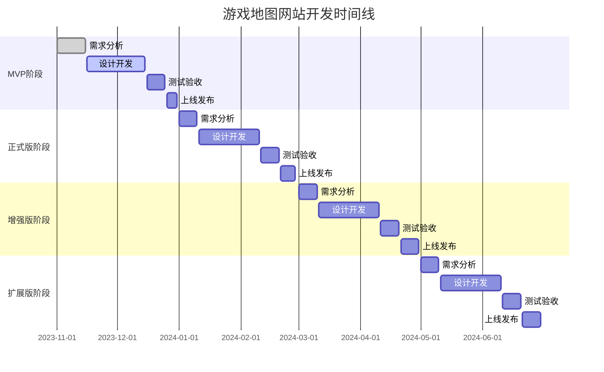

# 产品路线图 (Roadmap)

## 1. 路线图概述
本路线图规划了游戏地图网站的开发和迭代计划，明确了各阶段的核心目标和关键功能，为团队提供清晰的开发方向。

## 2. 版本规划策略
采用敏捷开发方法论，每2-3个月发布一个主要版本，期间根据用户反馈和优先级迭代小版本。版本规划遵循以下策略：
- 优先实现核心功能，确保产品MVP尽快上线
- 基于用户反馈和数据分析确定后续功能优先级
- 平衡新功能开发与已有功能优化

## 3. 详细版本规划

### 3.1 MVP版本 (v1.0)
- **发布时间**：2023年12月
- **核心目标**：实现基础地图功能、资源点显示和简单搜索
- **关键功能**：
  1. 单城市地图显示与交互
  2. 资源点数据加载与显示
  3. 基础搜索功能
  4. 用户位置保存功能
- **优先级**：所有功能均为P0
- **验收标准**：
  - 地图加载时间不超过5秒
  - 资源点显示准确率100%
  - 搜索响应时间不超过2秒
  - 位置保存功能正常工作

### 3.2 正式版 (v2.0)
- **发布时间**：2024年2月
- **核心目标**：完善地图功能，实现抽奖机系统和高级搜索
- **关键功能**：
  1. 多城市地图切换
  2. 抽奖机数据加载与显示
  3. 抽奖物品状态管理
  4. 高级搜索与过滤
  5. 地图标注功能
- **优先级**：功能1-4为P0，功能5为P1
- **验收标准**：
  - 城市切换流畅，无明显延迟
  - 抽奖机功能完整，状态保存持久
  - 搜索结果准确率100%
  - 标注功能操作简便

### 3.3 增强版 (v3.0)
- **发布时间**：2024年4月
- **核心目标**：提升用户体验，增加辅助功能
- **关键功能**：
  1. 资源收藏功能
  2. 路线规划功能
  3. 数据导出功能
  4. 响应式设计优化
  5. 性能优化
- **优先级**：功能1-3为P1，功能4-5为P0
- **验收标准**：
  - 收藏和规划功能用户满意度达85%以上
  - 数据导出格式兼容常用工具
  - 移动端适配良好
  - 页面加载速度提升30%

### 3.4 扩展版 (v4.0)
- **发布时间**：2024年6月
- **核心目标**：扩展产品功能，提升用户粘性
- **关键功能**：
  1. 用户账户系统
  2. 跨设备数据同步
  3. 多人协作功能
  4. 资源刷新时间提醒
  5. 数据分析仪表盘
- **优先级**：功能1-2为P0，功能3-5为P1
- **验收标准**：
  - 账户系统稳定，无数据丢失
  - 同步功能延迟不超过5秒
  - 协作功能操作流畅
  - 提醒功能准确率100%

## 4. 功能优先级矩阵
| 功能 | 优先级 | 版本 | 描述 |
|------|--------|------|------|
| 单城市地图 | P0 | v1.0 | 基础地图显示与交互 |
| 资源点显示 | P0 | v1.0 | 加载并显示资源点 |
| 基础搜索 | P0 | v1.0 | 简单资源搜索功能 |
| 位置保存 | P0 | v1.0 | 保存用户上次位置 |
| 多城市地图 | P0 | v2.0 | 支持城市地图切换 |
| 抽奖机系统 | P0 | v2.0 | 抽奖机显示与管理 |
| 高级搜索 | P0 | v2.0 | 高级搜索与过滤 |
| 地图标注 | P1 | v2.0 | 用户自定义标注 |
| 资源收藏 | P1 | v3.0 | 收藏常用资源点 |
| 路线规划 | P1 | v3.0 | 规划资源采集路线 |
| 数据导出 | P1 | v3.0 | 导出资源数据 |
| 响应式优化 | P0 | v3.0 | 移动端适配 |
| 性能优化 | P0 | v3.0 | 提升加载和运行速度 |
| 账户系统 | P0 | v4.0 | 用户注册与登录 |
| 数据同步 | P0 | v4.0 | 跨设备数据同步 |
| 多人协作 | P1 | v4.0 | 分享资源位置 |
| 刷新提醒 | P1 | v4.0 | 资源刷新时间提醒 |
| 数据分析 | P1 | v4.0 | 用户行为分析 |

## 5. 详细时间线计划

## 6. 资源规划
- **产品团队**：1名产品经理
- **设计团队**：1名UI设计师，1名UX设计师
- **开发团队**：2名前端开发工程师
- **测试团队**：1名测试工程师
- **数据团队**：1名数据分析师（兼职）

## 7. 风险管理
| 风险类型 | 风险描述 | 影响程度 | 发生概率 | 应对策略 |
|----------|----------|----------|----------|----------|
| 技术风险 | 地图渲染性能问题 | 高 | 中 | 提前进行性能测试，优化地图数据加载 |
| 数据风险 | 资源点数据不准确 | 中 | 高 | 建立数据验证机制，定期更新数据 |
| 进度风险 | 开发进度延迟 | 中 | 中 | 采用敏捷开发，每周跟踪进度，及时调整 |
| 市场风险 | 竞品推出类似功能 | 中 | 中 | 持续关注竞品动态，快速迭代优化 |
| 合规风险 | 游戏厂商投诉 | 高 | 低 | 加入免责声明，避免使用游戏商标和版权内容 |

---

本路线图将根据实际开发进度和用户反馈进行动态调整，确保产品能够快速响应市场需求。