# 用户故事地图 (User Story Map)

## 1. 用户故事地图概述
用户故事地图是一种可视化工具，用于组织和优先排序用户需求，帮助团队理解用户旅程和产品功能优先级。本用户故事地图基于游戏地图网站的核心功能和用户需求创建，旨在为开发团队提供清晰的用户视角。

## 2. 用户活动流 (横向)
用户在游戏地图网站中的主要活动流包括：
1. 浏览地图
2. 搜索资源
3. 管理抽奖机
4. 保存用户状态
5. 定制地图体验

## 3. 用户任务分解 (纵向)
以下是每个活动流下的具体用户任务和相关用户故事：

### 3.1 浏览地图
| 任务 | 用户故事 | 优先级 |
|------|----------|--------|
| 查看地图 | 作为一名游戏玩家，我想要查看游戏地图，以便了解资源分布和地理位置。 | P0 |
| 切换城市 | 作为一名游戏玩家，我想要切换不同城市的地图，以便查看不同区域的资源。 | P0 |
| 缩放和平移 | 作为一名游戏玩家，我想要缩放和平移地图，以便更详细地查看特定区域。 | P0 |
| 查看资源点 | 作为一名游戏玩家，我想要在地图上看到资源点标记，以便快速找到资源。 | P0 |
| 查看抽奖机 | 作为一名游戏玩家，我想要在地图上看到抽奖机标记，以便找到抽奖机位置。 | P0 |
| 查看详情 | 作为一名游戏玩家，我想要点击标记查看资源或抽奖机的详细信息，以便做出决策。 | P0 |

### 3.2 搜索资源
| 任务 | 用户故事 | 优先级 |
|------|----------|--------|
| 搜索资源 | 作为一名游戏玩家，我想要搜索特定资源，以便快速找到它的位置。 | P0 |
| 筛选资源 | 作为一名游戏玩家，我想要根据类型、数量等条件筛选资源，以便更精准地查找。 | P1 |
| 搜索奖品 | 作为一名游戏玩家，我想要搜索特定奖品，以便找到包含该奖品的抽奖机。 | P1 |
| 查看搜索结果 | 作为一名游戏玩家，我想要查看搜索结果列表，以便选择目标资源或抽奖机。 | P0 |
| 跳转到地图 | 作为一名游戏玩家，我想要点击搜索结果跳转到对应的地图位置，以便直接查看。 | P0 |

### 3.3 管理抽奖机
| 任务 | 用户故事 | 优先级 |
|------|----------|--------|
| 查看抽奖机 | 作为一名游戏玩家，我想要查看地图上的抽奖机，以便决定是否前往。 | P0 |
| 查看奖品列表 | 作为一名游戏玩家，我想要查看抽奖机中的奖品列表，以便了解可能获得的物品。 | P0 |
| 标记已抽奖品 | 作为一名游戏玩家，我想要标记已抽到的奖品，以便避免重复尝试。 | P0 |
| 取消标记 | 作为一名游戏玩家，我想要取消已抽奖品的标记，以便重新记录状态。 | P1 |
| 查看已抽奖品 | 作为一名游戏玩家，我想要查看已抽到的奖品列表，以便了解收集进度。 | P1 |

### 3.4 保存用户状态
| 任务 | 用户故事 | 优先级 |
|------|----------|--------|
| 保存位置 | 作为一名游戏玩家，我想要网站记住我上次的地图位置，以便下次继续浏览。 | P0 |
| 保存缩放 | 作为一名游戏玩家，我想要网站记住我上次的地图缩放大小，以便下次保持相同视图。 | P0 |
| 保存抽奖状态 | 作为一名游戏玩家，我想要网站记住我已抽奖品的状态，以便下次访问时保持同步。 | P0 |
| 导出状态 | 作为一名游戏玩家，我想要导出我的用户状态，以便在其他设备上使用。 | P2 |
| 导入状态 | 作为一名游戏玩家，我想要导入我的用户状态，以便在新设备上恢复设置。 | P2 |

### 3.5 定制地图体验
| 任务 | 用户故事 | 优先级 |
|------|----------|--------|
| 添加标注 | 作为一名游戏玩家，我想要在地图上添加自定义标注，以便标记重要位置。 | P1 |
| 收藏资源 | 作为一名游戏玩家，我想要收藏常用资源点，以便快速访问。 | P1 |
| 规划路线 | 作为一名游戏玩家，我想要规划资源采集路线，以便高效收集资源。 | P1 |
| 更改主题 | 作为一名游戏玩家，我想要更改地图主题，以便获得更好的视觉体验。 | P2 |
| 设置偏好 | 作为一名游戏玩家，我想要设置搜索和显示偏好，以便定制化使用体验。 | P2 |

## 4. 故事优先级与版本映射
以下是用户故事与产品版本的映射关系：

### 4.1 MVP版本 (v1.0)
- 查看地图
- 缩放和平移
- 查看资源点
- 搜索资源
- 查看搜索结果
- 跳转到地图
- 保存位置
- 保存缩放

### 4.2 正式版 (v2.0)
- 切换城市
- 查看抽奖机
- 查看详情
- 筛选资源
- 搜索奖品
- 查看奖品列表
- 标记已抽奖品
- 保存抽奖状态

### 4.3 增强版 (v3.0)
- 取消标记
- 查看已抽奖品
- 添加标注
- 收藏资源
- 规划路线

### 4.4 扩展版 (v4.0)
- 导出状态
- 导入状态
- 更改主题
- 设置偏好

## 5. 用户故事地图可视化

```mermaid
graph TD
    A[用户活动流] --> B[浏览地图]
    A --> C[搜索资源]
    A --> D[管理抽奖机]
    A --> E[保存用户状态]
    A --> F[定制地图体验]

    B --> B1[查看地图]
    B --> B2[切换城市]
    B --> B3[缩放和平移]
    B --> B4[查看资源点]
    B --> B5[查看抽奖机]
    B --> B6[查看详情]

    C --> C1[搜索资源]
    C --> C2[筛选资源]
    C --> C3[搜索奖品]
    C --> C4[查看搜索结果]
    C --> C5[跳转到地图]

    D --> D1[查看抽奖机]
    D --> D2[查看奖品列表]
    D --> D3[标记已抽奖品]
    D --> D4[取消标记]
    D --> D5[查看已抽奖品]

    E --> E1[保存位置]
    E --> E2[保存缩放]
    E --> E3[保存抽奖状态]
    E --> E4[导出状态]
    E --> E5[导入状态]

    F --> F1[添加标注]
    F --> F2[收藏资源]
    F --> F3[规划路线]
    F --> F4[更改主题]
    F --> F5[设置偏好]

    classDef v1 fill:#90EE90,stroke:#333,stroke-width:2px;
    classDef v2 fill:#87CEFA,stroke:#333,stroke-width:2px;
    classDef v3 fill:#FFB6C1,stroke:#333,stroke-width:2px;
    classDef v4 fill:#FFFACD,stroke:#333,stroke-width:2px;

    class B1,B3,B4,C1,C4,C5,E1,E2 v1;
    class B2,B5,B6,C2,C3,D1,D2,D3,E3 v2;
    class D4,D5,F1,F2,F3 v3;
    class E4,E5,F4,F5 v4;
```

---

本用户故事地图将根据用户反馈和产品迭代进行动态更新，确保产品开发始终以用户需求为中心。